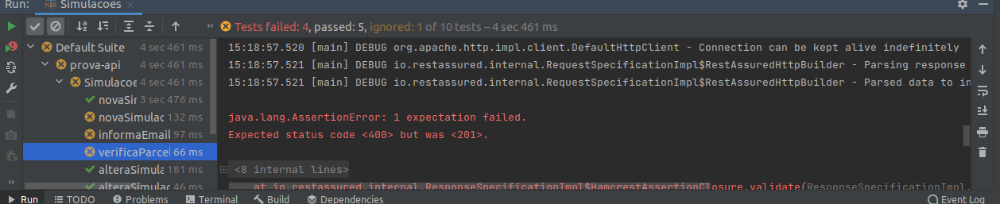

# Automação de teste de API com RestAssured e TestNG
Este arquivo possui como objetivo apresentar ao público uma automação de teste unitário de API utilizando as bibliotecas Restassured e Testng. No decorrer do documento serão dados mais detalhes acerca do processo de teste.

## Configurações do sistema
* Ubuntu 20.04 LTS
* Intel® Core™ i5-3337U
* 8GB RAM

## Desafio Maven
* Dependências
* Como instalar
* Como subir a API
* Documentação da API
* Regras verificadas na automação
* Como executar
* Interpretando o relatório

## Dependências

- [ ] Open JDK 1.8
- [ ] Maven
- [ ] Intellij IDEA Community (Opcional) 
- [ ] Postman (Opcional)
- [ ] Dependências e plugins

## Como instalar
O tutorial será direcionado para execução no sistema operacional Ubuntu, visto que este foi o sistema utilizado pelo autor para execução dos testes.
### Open JDK 1.8
Antes de instalar é interessante se já existe alguma versão do java instalado na sua máquina, para isso você pode executar o comando `java -version`. Caso haja qualquer resultado diferente de: 
<pre>openjdk version &quot;1.8.0_292&quot;
OpenJDK Runtime Environment (build 1.8.0_292-8u292-b10-0ubuntu1~20.04-b10)
OpenJDK 64-Bit Server VM (build 25.292-b10, mixed mode)</pre>
É possível instalar o JDK (Java Development Kit) 8 através do comando:
```bash
sudo apt-get install openjdk-8-jdk
```
Após isso há dois caminhos possíveis, caso exista outra versão do java na sua máquina você precisa apontar para a versão do jdk8 através do comando `sudo update-alternatives --config java` e selecionar a opção possivelmente representada por <pre>/usr/lib/jvm/java-8-openjdk-amd64/jre/bin/java</pre>
Caso não haja outra versão do Java você pode prosseguir com os próximos passos. 


### Maven
Para instalar o maven é necessário haver o Java já instalado na sua máquina, caso você tenha instalado neste tutorial é recomendado executar o comando `sudo apt update` antes de prosseguir. Para instalar o Maven é possível executar o comando 
```bash
sudo apt install maven
```
Após isso basta verificar se o maven foi instalado corretamente através do comando `mvn -version`

### Intellij IDEA Community
O uso da IDE (Integrated Development Environment) Intellij é opcional e você pode ficar a vontade para utilizar a que se sentir mais confortável, porém será demonstrado apenas o processo de instalação do intellij por ser a IDE utilizada neste projeto. Caso você ainda não tenha o intellij instalado na sua máquina, é possível instalar através do comando:
```bash
sudo snap install intellij-idea-community --classic --edge
```

### Postman
O Postman é uma ferramenta utilizada para diversas finalidades, inclusive para automação de testes unitários de API. Mas no escopo deste projeto seu uso é opcional e se dá apenas para realizar requisições manuais à API. É possível realizar a instalação desta ferramenta executando o comando:
```bash
sudo snap install postman
```

### Dependências e plugins
O Maven é uma plataforma de gestão de bibliotecas utilizada primariamente em projetos Java, a manipulação de bibliotecas e plugins no projeto se dá através de um arquivo denominado `pom.xml`, nele você armazena as dependências que seu projeto utilizará e o maven da automaticamente instala tudo o que você precisa. No escopo deste projeto, foram adicionadas os seguintes plugins e dependências:

Dependências:

    <dependency>
        <groupId>org.apache.maven.plugins</groupId>
        <artifactId>maven-compiler-plugin</artifactId>
        <version>3.8.1</version>
    </dependency>

    <dependency>
        <groupId>io.rest-assured</groupId>
        <artifactId>rest-assured</artifactId>
        <version>4.2.0</version>
        <scope>test</scope>
    </dependency>

    <dependency>
        <groupId>io.rest-assured</groupId>
        <artifactId>json-schema-validator</artifactId>
        <version>4.2.0</version>
        <scope>test</scope>
    </dependency>

    <dependency>
        <groupId>io.rest-assured</groupId>
        <artifactId>json-path</artifactId>
        <version>4.2.0</version>
        <scope>test</scope>
    </dependency>

    <dependency>
        <groupId>io.rest-assured</groupId>
        <artifactId>xml-path</artifactId>
        <version>4.2.0</version>
        <scope>test</scope>
    </dependency>

    <dependency>
        <groupId>org.testng</groupId>
        <artifactId>testng</artifactId>
        <version>7.4.0</version>
        <scope>test</scope>
    </dependency>

Plugins:
    
    <plugin>
        <groupId>org.springframework.boot</groupId>
        <artifactId>spring-boot-maven-plugin</artifactId>
    </plugin>

    <plugin>
        <groupId>org.apache.maven.plugins</groupId>
        <artifactId>maven-compiler-plugin</artifactId>
        <configuration>
            <source>8</source>
            <target>8</target>
        </configuration>
    </plugin>

## Como subir a API
Na raiz do projeto, através de seu Prompt de Commando/Terminal/Console execute o comando 

```bash
mvn clean spring-boot:run
```

A aplicação estará disponível através da URL [http://localhost:8080](http://localhost:8080)

Você pode trocar a porta da aplicação, caso a _8080_ já estiver em uso, adicionando a propriedade JVM `server.port`.

Exemplo:

```bash
mvn clean spring-boot:run -Dserver.port=8888
```

## Documentação da API
A documentação técnica da API está disponível através do OpenAPI/Swagger em [http://localhost:8080/swagger-ui.html](http://localhost:8080/swagger-ui.html)

## Regras verificadas na automação
### Restrições

`GET <host>/api/v1/restricoes/{cpf}`

O endpoint de Restrições tem a finalidade de consultar o CPF informando, retornando se ele possui ou não uma restrição. 

* Se não possui restrição do HTTP Status 204 é retornado
* Se possui restrição o HTTP Status 200 é retornado com a mensagem "O CPF 99999999999 possui restrição"

#### CPFs com restrição

| CPF |
| ----|
| 97093236014 |
| 60094146012 |
| 84809766080 |
| 62648716050 |
| 26276298085 |
| 01317496094 |
| 55856777050 |
| 19626829001 |
| 24094592008 |
| 58063164083 |

### Simulações

A simulação é um cadastro que ficará registrado informações importantes sobre o crédito como valor, parcelas, 
dados de contato, etc...

### Criar uma simulação

`POST <host>/api/v1/simulacoes`

Este endpoint é responsável por inserir uma nova simulação.

Existem os seguintes atributos a serem informados, com suas respectivas regras:

| Atributo | Obrigatório? | Regra |
|----------|--------------|-------|
| cpf | sim | texto informando o CPF não no formato 999.999.999-99 |
| nome | sim | texto informando o nome da pessoa |
| email | sim | texto informado um e-mail válido |
| valor | sim | valor da simulação que deve ser igual ou maior que R$ 1.000 e menor ou igual que R$ 40.000 |
| parcela | sim | número de parcelas para pagamento que deve ser igual ou maior que 2 e menor ou igual a 48 |
| seguro | sim | booleano `true` se com seguro e  `false` se sem seguro |

* Uma simulação cadastrada com sucesso retorna o HTTP Status 201 e os dados inseridos como retorno
* Uma simulação com problema em alguma regra retorna o HTTP Status 400 com a lista de erros
* Uma simulação para um mesmo CPF retorna um HTTP Status 409 com a mensagem "CPF já existente"

### Alterar uma simulação

`PUT <host>/api/v1/simulacoes/{cpf}`

Altera uma simulação já existente, onde o CPF deve ser informado para que a alteração possa ser efetuada.

* A alteração pode ser feita em qualquer atributo da simulação
* As mesmas regras se mantém
* Se o CPF não possuir uma simulação o HTTP Status 404 é retornado com a mensagem "CPF não encontrado"

### Consultar todas a simulações cadastradas

`GET <host>/api/v1/simulacoes`

Lista as simulações cadastradas.

* Retorna a lista de simulações cadastradas e existir uma ou mais
* Retorna HTTP Status 204 se não existir simulações cadastradas


### Consultar uma simulação pelo CPF

`GET <host>/api/v1/simulacoes/{cpf}`

Retorna a simulação previamente cadastrada pelo CPF.

* Retorna a simulação cadastrada
* Se o CPF não possuir uma simulação o HTTP Status 404 é retornado

### Remover uma simulação

`DELETE <host>/api/v1/simulacoes/{id}`

Remove uma simulação previamente cadastrada pelo seu ID.

* Retorna o HTTP Status 204 se simulação for removida com sucesso
* Retorna o HTTP Status 404 com a mensagem "Simulação não encontrada" se não existir a simulação pelo ID informado


## Como executar
Para começar é importante que você já tenha realizado o git pull ou baixado os arquivos deste repositório manualmente. Após isso, o intellij IDEA oferece algumas formas de inicialização, você pode selecionar a opção de abrir um projeto manualmente e navegar até o diretório onde você armazenou o repositório. Com o intellij aberto no diretório correto é interessante verificar a versão do Java que a IDE está utilizando pressionando o atalho `ctrl+alt+shift+s` e selecionando a opção `SDKs`. Caso haja outra SDK que não seja a SDK 1.8, é importante pressionar o ícone "+" e adicionar a SDK 1.8. Provavelmente a própria IDE irá identificar a versão instalada no seu sistema e sugerir na hora de adicionar. Após isso, é possível executar os testes de diversas formas, há o atalho `ctrl+shift+F10` que executa todos os testes registrados no diretório de teste, também é possível navegar pelos diretórios até encontrar a classe correspondente à implementação do teste do endpoint, clicar com o botão direito e executar os testes implementados na classe, e também é possível executar a rotina de testes diretamente dentro da classe, nessa última forma é possível tanto executar todos os casos de teste simultaneamente quanto executar cada caso de teste de forma independente. O relatório de teste fica disponível no console da IDE, onde é possível verificar quais testes foram aprovados, reprovados e bloqueados e a devida justificativa para cada estado.

## Interpretando o relatório
O intellij organiza os casos de teste de forma aleatória e realiza a execução de forma independente, para evitar este tipo de comportamento foi utilizado uma funcionalidade da biblioteca testng em que é possível estabelecer uma cadeia de casos de teste onde a falha de um caso de teste pode até mesmo impedir a execução de outro. No caso da imagem abaixo, é possível verificar a suite de teste utilizada por uma execução onde casos de teste implementados falharam e ao lado é possível enxergar a justificativa, que no caso do caso de teste da imagem foi que a requisição retornou um status code diferente do esperado. 


## Bugs Identificados
* O formato do cpf não está sendo validado pela API
* Ao realizar uma requisição POST com um CPF já cadastrado na base de dados a API retornou status code 400 "cpf duplicado" quando deveria retornar status code 409 "cpf xxxxxx ja existente"
* A API permitiu registrar valores fora do intervalo previsto para os atributos "valor" e "parcelas"
* Realizar requisição POST com parcelas maiores que o esperado trazendo mensagem de email incorreto no body.
* Realizar requisição POST com email fora do padrão estabelecido traz diferentes mensagens no body response.


